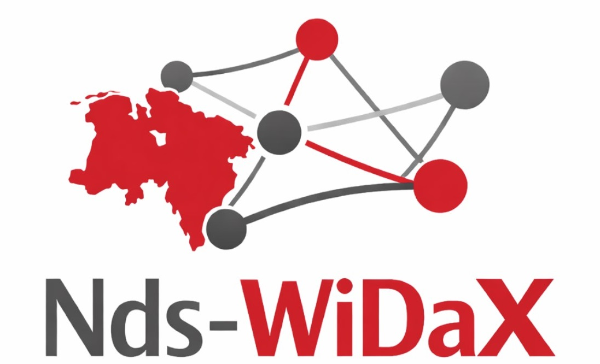
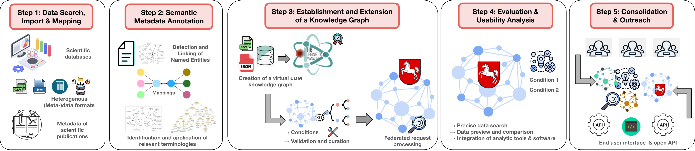
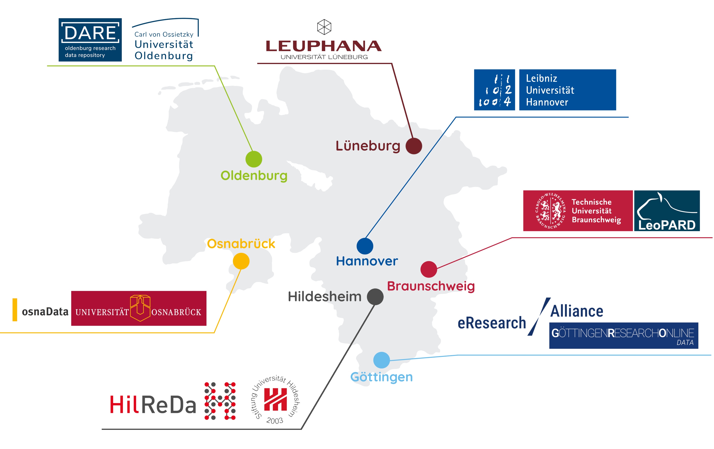

# Nds-WiDaX: Semantically Enriched Knowledge Graph for Linking Research Data Repositories in Lower Saxony

   

> [**"Why it takes a village to do FAIR Data Management"**](https://doi.org/10.1162/99608f92.42eec111) – Nds-WiDaX brings together Lower Saxony’s research data infrastructures into a unified, semantically enriched knowledge graph.

## Project Overview

The **Nds-WiDaX** project aims to sustainably network research data infrastructures in Lower Saxony by developing a domain-specific, semantically enriched knowledge graph.

Recognizing that effective research data management (RDM) is a collaborative challenge requiring cooperation and technical interoperability across disciplinary and institutional boundaries, Nds-WiDaX builds on the [**Leibniz Data Manager (LDM)**](https://github.com/SDM-TIB/LDM_Docker) – an open, semantics-oriented software service – to enable machine-readable, contextually rich indexing of heterogeneous (meta)data from research data repositories across Lower Saxony.

The resulting knowledge graph semantically links digital research objects using ontologies, controlled vocabularies, and named entity recognition (NER).
It supports the exploration, comparability, and reuse of research data through user-friendly, federated interfaces.

## Target Groups

1. **Researchers**  
   - Direct access to relevant, interoperable datasets via semantic search  
   - Automated recommendations for related datasets  

2. **Scientific Institutions**  
   - Integration of standard-compliant interfaces and metadata exports  
   - Added value for data management and research infrastructure development

3. **Research in Lower Saxony as a Whole**  
   - Improved findability, interoperability, and connection to national ([NFDI](https://www.nfdi.de/)) and international ([EOSC](https://eosc.eu/)) initiatives  
   - Contribution to the implementation of the **FAIR principles** (Findable, Accessible, Interoperable, Reusable)  
   - Establishment of an open, intelligently searchable data ecosystem

4. **Data infrastructures**
   - Automated mapping and enrichment of metadata with semantic annotations; reduced manual metadata maintenance effort
   - Possible infrastructure target groups include:
      - Universities and research institutions with their own (domain-specific) data repositories
      - State and municipal research centers
      - Libraries and information centers

5. **Data Service Providers**
   - Use of SPARQL endpoints and REST APIs for integration into external systems
   - Connection to data management and service providers, e.g., [ORKG](https://orkg.org/), [Wikibase](https://wikiba.se/), [DBpedia](https://www.dbpedia.org/)

## Repository structure

<!-- TODO: Add table of repo paths and their purposes -->
*Coming soon*

**Current Status**

This repository currently contains metadata mappings from a selection of research data repositories in Lower Saxony.
These mappings serve as the foundation for building a unified knowledge graph and will be expanded to include:

- Full data harvesting pipeline (incl. open source code for all steps)  
- Semantic enrichment workflows (NER, ontology alignment)  
- Knowledge graph construction and storage (RDF triplestores)  
- Documentation of ontologies, mappings, and best practices
- Example SPARQL queries

## Data Sources

The metadata of the following research data repositories in Lower Saxony is being incorporated into Nds-WiDaX (including harmonisation of terms and structure; capturing and solving interoperability issues):

- Leibniz University Hannover: [Research Data Repository](https://data.uni-hannover.de/)  
- University of Göttingen: [Göttingen Research Online Data (GRO.data)](https://data.goettingen-research-online.de/)  
- Technische Universität Braunschweig: [Publications And Research Data (LeoPARD)](https://leopard.tu-braunschweig.de/)  
- University of Oldenburg: [Oldenburg Research Data Repository (DARE)](https://dare.uol.de/)  
- Leuphana University of Lüneburg: [PubData](https://pubdata.leuphana.de/)  
- Osnabrück University: [osnaData](osnadata.ub.uni-osnabrueck.de/)
- University of Hildesheim: [HilReDa](data.goettingen-research-online.de/dataverse/hilreda/)

## Participating Institutions

- **Lead**: [Technische Informationsbibliothek (TIB)](https://www.tib.eu), Hannover  
- **Project Lead**:
   - Angelina Kraft ([@kraftalin](https://github.com/kraftalin))
   - Maria-Esther Vidal ([@mevs](https://github.com/mevs))
- This is a "Säule 3" project of the [FDM-NDS](https://fdm-nds.de/) initiative (Research Data Management Lower Saxony)  

## License

- All files outside of the directory [`docs/widax_images/`](docs/widax_images) are licensed under [MIT License](LICENSE).
- All files within the directory [`docs/widax_images/`](docs/widax_images) are licensed under [CC BY 4.0](docs/widax_images/LICENSE-CC-BY-4.0).

## Contact

Developed by [Mauricio Brunet](https://github.com/Rmbruno11) and [Jasmin Frangenberg](https://github.com/jasmezz). We acknowledge all members of the [SDM-TIB](https://github.com/SDM-TIB/) group for their helpful feedback and support.

🌐 [Website](https://service.tib.eu/ldm_ndswidax/ldmservice/) *(coming soon)*  
✍️ [GitHub issues](https://github.com/SDM-TIB/Nds-WiDaX-mappings/issues)

**We welcome feedback, requests and bug reports!**